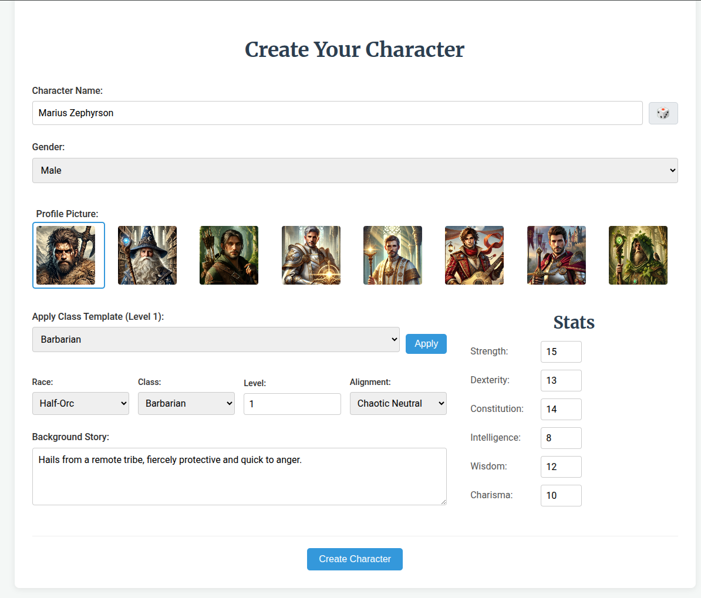

# DungeonGPT (JS): Character Creator & AI Game Master

This is a web application built with React that allows users to create detailed characters for role-playing games, manage them, and use them in an interactive game session powered by an AI (default: OpenAI's GPT models).

This project is based upon the [Python version of the same name](https://github.com/EdwardAThomson/DungeonGPT).

YouTube Video 🎥:

* [How To Play / Overview](https://youtu.be/CGskdUTQnMo)


## Features

*   **Character Creation:** Detailed form to define character stats, class, race, background, alignment, and profile picture.
*   **Character Management:** View all created characters, edit existing characters.
*   **Game Setup:** Configure settings for a new game session (description, rules, world seed).
*   **Hero Selection:** Choose created characters to form a party for the game.
*   **AI-Powered Game:** Engage in an interactive text-based adventure where the AI acts as the game master, responding to user actions and summarizing the story.
*   **World Map:** Explore a procedurally generated world map with biomes, towns, and points of interest.
*   **Encounter System:** Dynamic encounters with skill checks, rewards, and AI-narrated outcomes.
*   **Inventory & Progression:** Track party inventory, gold, HP, and XP progression.
*   **Multi-Provider AI:** Support for OpenAI, Google Gemini, Anthropic Claude (cloud APIs and CLI modes), and Cloudflare Workers AI.
*   **Persistent Sessions:** Characters and game sessions saved via backend server and SQLite database.
*   **Save/Load System:** Manual and auto-save functionality with save confirmation modals.

## Technology Stack

*   **Frontend:** React (Hooks, Context API)
*   **Routing:** React Router DOM
*   **Styling:** Modular CSS (feature-based organization in `src/styles/`)
*   **Backend:** Node.js / Express (`src/server.js`) + Cloudflare Workers (optional)
*   **Database:** SQLite (`src/game.db`)
*   **AI Providers:** OpenAI, Google Gemini, Anthropic Claude (cloud APIs and CLI modes), Cloudflare Workers AI

## Project Structure

```
src/
├── components/      # Reusable UI components (modals, panels, maps)
├── contexts/        # React Context providers (Settings, API keys)
├── data/            # Static game data (encounters, races, classes)
├── game/            # Game logic controllers (movement, encounters, saves)
├── hooks/           # Custom React hooks (useGameMap, useGameSession, etc.)
├── llm/             # LLM integration (model resolver, constants)
├── pages/           # Page components (Game, CharacterCreation, etc.)
├── services/        # API client services (characters, conversations, LLM)
├── styles/          # Feature-based CSS files
├── utils/           # Utility functions (map generation, health system, etc.)
└── server.js        # Express backend server

cf-worker/           # Cloudflare Workers AI backend (optional)
├── src/
│   ├── index.ts     # Hono app entry point
│   ├── routes/      # API routes (/api/ai/*)
│   └── services/    # Workers AI service layer
└── wrangler.toml    # Cloudflare Workers config
```

The following images shows the chat interface of DungeonGPT:




## Setup and Installation

1.  **Clone the repository:**
    ```bash
    git clone <your-repository-url>
    cd character-creation
    ```

2.  **Install dependencies:**
    ```bash
    npm install
    ```

3.  **Set up Environment Variables:**
    *   Copy `.env.example` to `.env` and configure your API keys:
    ```bash
    cp .env.example .env
    ```
    *   Add your LLM API keys to `.env`:
    ```
    OPENAI_API_KEY=your-openai-key
    GEMINI_API_KEY=your-gemini-key
    ANTHROPIC_API_KEY=your-claude-key
    ```
    *   API keys are handled securely by the backend server — they are never exposed to the frontend.

4.  **Run the backend server (Required for Database Persistence):**
    *   The backend server (`src/server.js`) handles saving and loading characters to/from the SQLite database (`src/game.db`).
    *   **This server must be running** in a separate terminal for character saving/loading features to work.
    *   Open a terminal, navigate to the project root directory, and run:

    ```bash
    node src/server.js
    ```
    
    *   Keep this terminal window open while using the application.

4b. **Optional: Run Cloudflare Workers AI (Alternative AI Provider):**
    *   If you want to use Cloudflare Workers AI instead of cloud API providers:
    *   Navigate to the `cf-worker` directory and run:

    ```bash
    cd cf-worker
    npm install
    npm run dev
    ```
    
    *   The worker will start on `http://localhost:8787`
    *   Select `cf-workers` as your AI provider in the game settings

5.  **Run the React development server:**
    *   In **another** terminal window (while the backend server is running), navigate to the project root directory and run:

    ```bash
    npm start
    ```

    *   This will open the application in your default browser, usually at `http://localhost:3000`.

## Usage

1.  **Navigate** through the sections using the top navigation bar (Home, Character Creator, All Characters, New Game).
2.  **Create a character** using the "Character Creator" form.
3.  **View and manage** your characters under "All Characters".
4.  **Start a new game** by going to "New Game", filling in the settings, and then selecting your heroes on the subsequent "Hero Selection" page.
5.  **Play the game:** Interact with the AI game master by typing actions in the input box on the "Game" screen.

## Recent Improvements

*   ✅ **Cloudflare Workers AI Integration** — No API keys required for public deployment
*   ✅ **Save/Load System** — Manual save with confirmation, auto-save, and legacy save compatibility
*   ✅ **API Security** — API keys handled securely by backend (not exposed to frontend)
*   ✅ **Modular Architecture** — Controllers for movement, encounters, saves
*   ✅ **Multi-Provider AI** — OpenAI, Gemini, Claude, Cloudflare Workers (cloud and CLI modes)
*   ✅ **Environment-Aware Logging** — Production-safe logging system
*   ✅ **Feature-Based CSS** — Modular styling for maintainability
*   ✅ **Procedural World Map** — Biomes, towns, mountains with exploration
*   ✅ **Dynamic Encounters** — Skill checks, rewards, AI narration
*   ✅ **Town Discovery System** — Buildings discovered and remembered across sessions
*   ✅ **Debug Tools** — CF Worker debug page for testing AI integration

## Potential Future Improvements

*   User authentication and multi-user support
*   Migration to Cloudflare D1 for full edge deployment
*   Streaming AI responses for better UX
*   Unit and integration tests for core game loops
*   Additional encounter types and world events
*   Dungeon/cave sub-maps with procedural generation

## License & Attribution

This project is licensed under the **Apache License 2.0**. See the [LICENSE](./LICENSE) file for details.

### Character Portrait Artwork

All character portrait images were generated using ChatGPT's AI image generation (DALL-E) and are owned by the project creator under OpenAI's Terms of Use. See [CREDITS.md](./CREDITS.md) for full attribution details.

### Game Content

All game content (character descriptions, encounter text, story elements) is original content created for this project. Race and class names use generic fantasy terms or original terminology to avoid trademark conflicts:

- **Original race names:** Smallfolk, Demonkin, Dragonkin
- **Generic race names:** Human, Dwarf, Elf, Gnome, Half-Elf, Half-Orc
- **Generic class names:** Barbarian, Bard, Cleric, Druid, Fighter, Monk, Paladin, Ranger, Rogue, Sorcerer, Warlock, Wizard

### Game Mechanics

This project uses d20-based game mechanics (rolling a 20-sided die for skill checks and attacks), which are not copyrighted and are used across many role-playing games. This project does **not** use the Open Game License (OGL) and does not claim compatibility with any specific game system.

### Third-Party Libraries

This project uses various open-source libraries (React, Express, SQLite3, etc.) under their respective licenses. See [CREDITS.md](./CREDITS.md) for a complete list.

For contribution guidelines, see [CONTRIBUTING.md](./CONTRIBUTING.md) if available.
