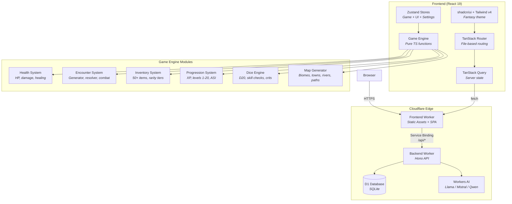

<div align="center">

# DungeonGPT

**AI-Powered Tabletop RPG in Your Browser**

[](https://workers.cloudflare.com/)
[](https://react.dev/)
[](https://www.typescriptlang.org/)
[](https://tailwindcss.com/)
[](https://hono.dev/)
[](https://developers.cloudflare.com/d1/)
[](https://developers.cloudflare.com/workers-ai/)
[](LICENSE)

Create characters. Explore procedurally generated worlds. Fight monsters. Gain loot. Level up. All narrated by an AI Dungeon Master running on Cloudflare Workers AI.

[Live Demo](https://dungeongpt.devteam-203.workers.dev) | [Video Overview](https://youtu.be/CGskdUTQnMo)

</div>

---


## What Is This?

DungeonGPT is a full-stack browser RPG that combines AI-driven narrative with real game mechanics. An AI Dungeon Master narrates your adventure while a D20 game engine handles encounters, HP, inventory, XP progression, and dice rolls behind the scenes.

Based on the [Python original](https://github.com/EdwardAThomson/DungeonGPT) by Edward Thomson.

### Gameplay Loop

1. **Create characters** with stats, class, race, alignment, and portraits
2. **Configure your world** — grimness, magic level, campaign goals, milestones
3. **Generate a procedural world map** with biomes, towns, rivers, mountain ranges, and roads
4. **Explore the map** — click tiles or use arrow keys to move your party
5. **Encounter monsters** — biome-based random encounters trigger as you explore
6. **Resolve combat** — D20 skill checks, multi-round fights, flee attempts
7. **Gain rewards** — XP, gold, and loot flow into your inventory
8. **Level up** — XP thresholds, stat bonuses, HP increases
9. **Chat with the AI DM** — the narrator knows your HP, inventory, and encounter history
10. **Save and resume** — full game state persists to Cloudflare D1

## Screenshots


## Architecture



## Tech Stack

| Layer | Technology | Purpose |
|-------|-----------|---------|
| **Runtime** | Cloudflare Workers | Edge compute, zero cold starts |
| **Frontend** | React 19 + Vite 7 | UI framework + build tool |
| **Routing** | TanStack Router | Type-safe file-based routing |
| **Server State** | TanStack Query | Data fetching, caching, mutations |
| **Client State** | Zustand 5 | Game store, UI store, settings store |
| **Forms** | TanStack Form + Zod | Validated character creation |
| **Styling** | Tailwind CSS v4 + shadcn/ui | Fantasy-themed design system |
| **API** | Hono 4 | Lightweight edge-native framework |
| **Database** | Cloudflare D1 (SQLite) | Characters + saved games |
| **ORM** | Drizzle ORM | Type-safe D1 queries |
| **AI** | Workers AI | Free LLM inference (Llama, Mistral, Qwen) |
| **Schemas** | Zod | Shared validation — single source of truth |
| **Language** | TypeScript (strict) | `noUncheckedIndexedAccess`, `exactOptionalPropertyTypes` |
| **Monorepo** | pnpm workspaces | `frontend/`, `backend/`, `shared/` |
| **Linting** | ESLint 9 flat config | 8 plugins, all rules set to error |

## Project Structure

```
DungeonGPT-JS/
├── frontend/                    # React 19 + Vite 7
│   ├── src/
│   │   ├── api/                 # TanStack Query hooks
│   │   ├── design-system/       # shadcn/ui + fantasy tokens
│   │   ├── game/                # Pure TS game engine
│   │   │   ├── dice/            # D20, skill checks, crits
│   │   │   ├── encounters/      # Generator, resolver, combat, templates
│   │   │   ├── health/          # HP init, damage, healing
│   │   │   ├── inventory/       # 50+ items, rarity, effects
│   │   │   ├── maps/            # World gen, town gen, names
│   │   │   ├── npcs/            # NPC generator, A* pathfinding
│   │   │   ├── progression/     # XP thresholds, level-up, ASI
│   │   │   └── rules/           # Skill-stat mapping, DC system
│   │   ├── hooks/               # useMapMovement, useGameSession, etc.
│   │   ├── pages/               # TanStack Router file-based routes
│   │   └── stores/              # Zustand (game, ui, settings)
│   └── worker/                  # Frontend Worker (static assets + proxy)
├── backend/                     # Cloudflare Worker + Hono
│   ├── src/
│   │   ├── db/                  # Drizzle schema + queries
│   │   ├── middleware/          # Validation, errors, CORS, security
│   │   ├── routes/              # Characters, conversations, AI
│   │   └── services/            # Workers AI, model tiers, DM protocol
│   └── migrations/              # D1 SQL migrations
├── shared/                      # @dungeongpt/shared
│   └── src/schemas/             # Zod schemas (character, conversation, API)
└── .project/                    # Build plan, PRD, tech stack, changelog
```

## Getting Started

### Prerequisites

- [Node.js](https://nodejs.org/) >= 20
- [pnpm](https://pnpm.io/) >= 9

### Install & Run

```bash
# Clone
git clone https://github.com/EdwardAThomson/DungeonGPT-JS.git
cd DungeonGPT-JS

# Install dependencies
pnpm install

# Run dev servers (frontend + backend)
pnpm dev
```

Frontend runs at `http://localhost:5173`, backend at `http://localhost:8787`.

### Build & Verify

```bash
# Full CI pipeline: lint + typecheck + knip + format + build
pnpm ci:check
```

### Deploy

```bash
# Deploy backend Worker
cd backend && pnpm deploy

# Deploy frontend Worker
cd frontend && npx wrangler deploy
```

## Game Systems

| System | Description |
|--------|-------------|
| **World Map** | 10x10 procedural grid with biomes (plains, forest, mountain, water, beach), rivers, roads, towns, caves, POIs |
| **Movement** | Click tiles or arrow keys. Manhattan adjacency. Water blocks movement. Tiles reveal on explore. |
| **Encounters** | Biome-based random trigger. 50+ encounter templates. Suggested actions (fight/flee/negotiate/sneak). |
| **Combat** | D20 skill checks with stat modifiers. Critical success/failure. Multi-round fights with morale and enemy HP. |
| **Health** | Constitution-based HP. Damage from encounters and failed flees. Healing potions with dice rolls. |
| **Inventory** | 50+ items across 4 rarity tiers. Consumables with heal effects. Gold economy. Per-hero storage. |
| **Progression** | XP from encounters. 20-level system with class-specific thresholds. Ability Score Increases at 4/8/12/16/19. |
| **AI DM** | Receives party HP, inventory highlights, encounter history, milestones. Narrates with mechanical awareness. |
| **Save/Load** | Full game state to D1: conversation, map, position, hero states, settings. 30-second auto-save. |

## AI Models

All AI runs on **Cloudflare Workers AI** — no API keys needed, no external services.

| Tier | Models | Use Case |
|------|--------|----------|
| Fast | Llama 3.1 8B, Mistral Nemo | Quick responses, low latency |
| Balanced | Llama 3.1 70B, Qwen 72B | Rich narration, good quality |
| Quality | Llama 3.3 70B | Best narrative quality |

## Credits

- **Edward Thomson** — original DungeonGPT concept and Python implementation
- Character portraits and artwork by Edward Thomson
- Built with [Cloudflare Workers](https://workers.cloudflare.com/), [React](https://react.dev/), [Hono](https://hono.dev/), [shadcn/ui](https://ui.shadcn.com/)
