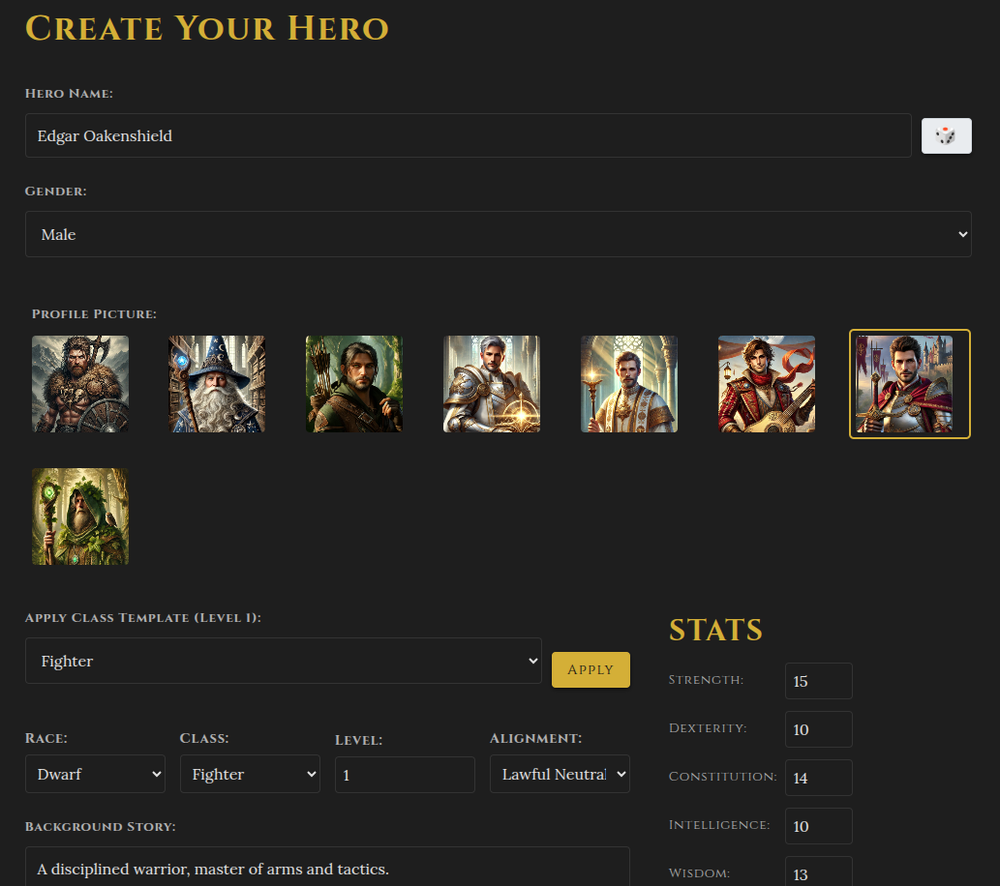
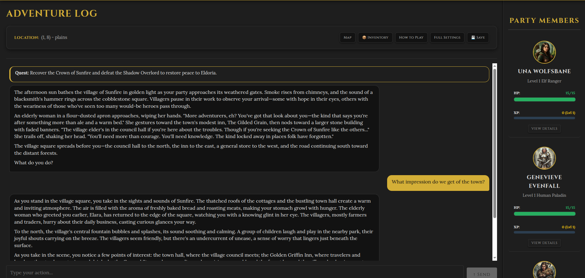

# DungeonGPT (JS): Character Creator & AI Game Master

**🎮 Live App:** https://dungeongpt-js.pages.dev/

This is a web application built with React that allows users to create detailed characters for role-playing games, manage them, and use them in an interactive game session powered by an AI (default: OpenAI's GPT models).

This project is based upon the [Python version of the same name](https://github.com/EdwardAThomson/DungeonGPT).

YouTube Video 🎥:

* [How To Play / Overview](https://youtu.be/CGskdUTQnMo)


## Features

*   **Character Creation:** Detailed form to define character stats, class, race, background, alignment, and profile picture.
*   **Character Management:** View all created characters, edit existing characters.
*   **Game Setup:** Configure settings for a new game session (description, rules, world seed).
*   **Hero Selection:** Choose created characters to form a party for the game.
*   **AI-Powered Game:** Engage in an interactive text-based adventure where the AI acts as the game master, responding to user actions and summarizing the story.
*   **World Map:** Explore a procedurally generated world map with biomes, towns, and points of interest.
*   **Encounter System:** Dynamic encounters with skill checks, rewards, and AI-narrated outcomes.
*   **Inventory & Progression:** Track party inventory, gold, HP, and XP progression.
*   **Multi-Provider AI:** Support for OpenAI, Cloudflare Workers AI, and other providers.
*   **User Authentication:** Secure sign-in with Supabase Magic Link authentication.
*   **Persistent Sessions:** Characters and game sessions saved to Supabase PostgreSQL database with Row Level Security.
*   **Save/Load System:** Manual and auto-save functionality with save confirmation modals.

## Technology Stack

*   **Frontend:** React (Hooks, Context API) - Deployed on Cloudflare Pages
*   **Routing:** React Router DOM
*   **Styling:** Modular CSS (feature-based organization in `src/styles/`)
*   **Backend:** Cloudflare Workers (TypeScript with Hono framework)
*   **Database:** Supabase PostgreSQL with Row Level Security (RLS)
*   **Authentication:** Supabase Auth (Magic Link)
*   **AI Providers:** Cloudflare Workers AI, OpenAI (server-side only, no exposed keys)

## Project Structure

```
src/
├── components/      # Reusable UI components (modals, panels, maps)
├── contexts/        # React Context providers (Auth, Settings)
├── data/            # Static game data (encounters, races, classes)
├── game/            # Game logic controllers (movement, encounters, saves)
├── hooks/           # Custom React hooks (useGameMap, useGameSession, etc.)
├── llm/             # LLM integration (model resolver, constants)
├── pages/           # Page components (Game, CharacterCreation, Login, etc.)
├── services/        # API client services (Supabase, heroes, conversations, LLM)
├── styles/          # Feature-based CSS files
└── utils/           # Utility functions (map generation, health system, etc.)

cf-worker/           # Cloudflare Workers backend (production)
├── src/
│   ├── index.ts     # Hono app entry point
│   ├── routes/      # API routes (heroes, conversations, AI)
│   ├── middleware/  # Auth middleware (Supabase JWT validation)
│   └── services/    # Workers AI service layer
└── wrangler.toml    # Cloudflare Workers config
```

The following image shows the character creator interface of DungeonGPT:



The following image shows the chat interface of DungeonGPT:




## Setup and Installation

### Local Development

This is a guide for deploying the app locally.

1.  **Clone the repository:**

    ```bash
    git clone https://github.com/EdwardAThomson/DungeonGPT-JS.git
    cd DungeonGPT-JS
    ```

2.  **Install dependencies:**
    ```bash
    npm install
    ```

3.  **Set up Environment Variables:**

    *   Copy `.env.example` to `.env` and configure:

    ```bash
    cp .env.example .env
    ```

    *   Edit `.env` and add your LLM API keys:

    ```
    OPENAI_API_KEY=your-openai-key
    GEMINI_API_KEY=your-gemini-key
    ANTHROPIC_API_KEY=your-claude-key
    ```

    *   The default settings in `.env.example` should work for local development (port 5000 for backend, port 3000 for frontend).
    *   API keys are handled securely by the backend server — they are never exposed to the frontend.

4.  **Run the backend server (Required for Database Persistence):**

    *   The backend server (`src/server.js`) handles saving and loading characters to/from the SQLite database (`src/game.db`).
    *   **This server must be running** in a separate terminal for character saving/loading features to work.
    *   Open a terminal, navigate to the project root directory, and run:

    ```bash
    node src/server.js
    ```
    
    *   Keep this terminal window open while using the application.

5.  **Run the React development server:**

    *   In a new terminal, from the project root:

    ```bash
    npm start
    ```

    *   This will open the application at `http://localhost:3000`

### Production Deployment

The app is deployed on:

- **Frontend:** Cloudflare Pages (https://dungeongpt-js.pages.dev/)
- **Backend:** Cloudflare Workers
- **Database:** Supabase PostgreSQL

For deployment instructions, see the deployment guides in `/docs`.

## Usage

1.  **Create a hero** using the "Hero Creator" form with detailed stats, class, race, and background
2.  **View and manage** your heroes under "All Heroes"
3.  **Start a new game** by going to "New Game", configuring settings, and selecting your party
4.  **Explore the world** with a procedurally generated map featuring biomes, towns, and encounters
5.  **Play the game** by interacting with the AI Dungeon Master through text commands
6.  **Save your progress** - characters and game sessions are saved to the local SQLite database

**Note:** The live production app at https://dungeongpt-js.pages.dev/ includes additional features like Magic Link authentication (soon) and cloud persistence via Supabase.

## Recent Improvements

*   ✅ **Production Deployment** — Live on Cloudflare Pages with Workers backend
*   ✅ **Supabase Integration** — PostgreSQL database with Row Level Security
*   ✅ **Magic Link Authentication** — Secure, passwordless sign-in
*   ✅ **Cloudflare Workers AI** — Server-side AI with no exposed API keys
*   ✅ **Multi-User Support** — Each user's data isolated with RLS policies
*   ✅ **Save/Load System** — Manual save with confirmation, auto-save, cloud persistence
*   ✅ **Modular Architecture** — Controllers for movement, encounters, saves
*   ✅ **Multi-Provider AI** — OpenAI, Gemini, Claude, Cloudflare Workers (cloud and CLI modes) [Local Dev Mode]
*   ✅ **Environment-Aware Logging** — Production-safe logging system
*   ✅ **Feature-Based CSS** — Modular styling for maintainability
*   ✅ **Procedural World Map** — Biomes, towns, mountains with exploration
*   ✅ **Dynamic Encounters** — Skill checks, rewards, AI narration
*   ✅ **Town Discovery System** — Buildings discovered and remembered across sessions
*   ✅ **How to Play Page** — Comprehensive guide for new players
*   ✅ **E2E Testing** — Playwright tests for critical user flows

## Potential Future Improvements

*   💳 **Billing Integration** — Credit-based system with Lemon Squeezy
*   📊 **Usage Tracking** — AI usage analytics and cost monitoring
*   🚀 **Rate Limiting** — Request throttling and abuse prevention
*   📈 **Monitoring** — Error tracking and performance metrics
*   🎬 **Streaming AI Responses** — Real-time text generation for better UX
*   🧪 **Expanded Testing** — Unit and integration tests for core game loops
*   🗺️ **Dungeon Sub-Maps** — Procedurally generated caves and dungeons
*   ⚔️ **Combat System** — Turn-based tactical combat encounters
*   🎭 **NPC Interactions** — Persistent NPCs with memory and relationships

## License & Attribution

This project is licensed under the **Apache License 2.0**. See the [LICENSE](./LICENSE) file for details.

### Character Portrait Artwork

All character portrait images were generated using ChatGPT's AI image generation (DALL-E) and are owned by the project creator under OpenAI's Terms of Use. See [CREDITS.md](./CREDITS.md) for full attribution details.

### Game Content

All game content (character descriptions, encounter text, story elements) is original content created for this project. Race and class names use generic fantasy terms or original terminology to avoid trademark conflicts:

- **Original race names:** Smallfolk, Demonkin, Dragonkin
- **Generic race names:** Human, Dwarf, Elf, Gnome, Half-Elf, Half-Orc
- **Generic class names:** Barbarian, Bard, Cleric, Druid, Fighter, Monk, Paladin, Ranger, Rogue, Sorcerer, Warlock, Wizard

### Game Mechanics

This project uses d20-based game mechanics (rolling a 20-sided die for skill checks and attacks), which are not copyrighted and are used across many role-playing games. This project does **not** use the Open Game License (OGL) and does not claim compatibility with any specific game system.

### Third-Party Libraries

This project uses various open-source libraries (React, Express, SQLite3, etc.) under their respective licenses. See [CREDITS.md](./CREDITS.md) for a complete list.

For contribution guidelines, see [CONTRIBUTING.md](./CONTRIBUTING.md) if available.
